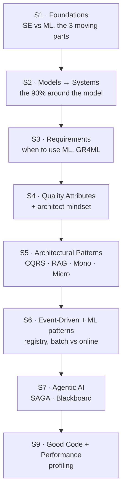

# Software Engineering for Machine Learning (SE4ML) — Study Notes

> Course code **AIMLCZG546** · Instructor: Dr. Shreyas Rao (BITS-Pilani, WILP)
> Textbooks — **T1:** *Machine Learning in Production: From Models to Products*, Christian Kästner (MIT Press, 2025) · **T2:** *Software Engineering for Data Scientists*, Catherine Nelson (O'Reilly, 2024)

These are my own revision notes for the course. Each note **synthesises two sources into one**:

1. **The lecture slides** (`../Slides/Session NN …pptx`) — the definitions and structure.
2. **The companion readers** (`../friend notes/*.pdf`) — the *why*, worked in plain English.

Every note is written to be **read on its own months later** — plain-English first, jargon defined on first use, diagrams for anything with moving parts, and a one-line **takeaway** per topic.

---

## 📚 Session index

| # | Note | Topic in one line | Slides | Companion |
|---|------|-------------------|:------:|:---------:|
| 1 | [Foundations of ML Systems Engineering](Session-01-Foundations-of-ML-Systems-Engineering.md) | SDLC, data science, ML basics, and **SE vs ML** | ✅ | 1.pdf |
| 2 | [From Models to Systems](Session-02-From-Models-to-Systems.md) | A model is a *sliver* of a product; predictive / generative / agentic AI | ✅ | 4.pdf |
| 3 | [Requirements Engineering for ML](Session-03-Requirements-Engineering-for-ML.md) | **When to use ML**, goals → requirements, GR4ML notation | ✅ | 5.pdf |
| 4 | [Quality Attributes & System Architecture](Session-04-Quality-Attributes-and-System-Architecture.md) | The *how well*: quality attributes + thinking like an architect | ✅ | 6.pdf |
| 5 | [Architectural Patterns for ML Systems](Session-05-Architectural-Patterns-for-ML-Systems.md) | **CQRS · RAG · Monolith · Microservices** | ✅ | 7.pdf |
| 6 | [Event-Driven Architecture & ML Design Patterns](Session-06-Event-Driven-Architecture-and-ML-Design-Patterns.md) | Events, **Model Registry**, batch vs real-time serving | ✅ | 8.pdf |
| 7 | [Agentic AI & Coordination Patterns](Session-07-Agentic-AI-and-Coordination-Patterns.md) | Chatbots → doers; **SAGA** & **Blackboard** patterns | ✅ | 9.pdf |
| 9 | [Implementation & Code Sharing](Session-09-Implementation-and-Code-Sharing.md) ⭐ | **What is good code** + analysing code performance (profiling) | ✅ | — |

⭐ = currently studying.  Session 8 slides were not part of this set.

**Extras**
- [Course Overview](00-Course-Overview.md) — objectives, module map, tools, evaluation scheme.
- [Quick Revision Sheet](Quick-Revision-Sheet.md) — the whole course on one page for exam eve.
- Webinar companions: [W1 — Notebook to Production](Webinar-1-Notebook-to-Production.md) · [W2 — CI/CD with GitHub Actions & DVC](Webinar-2-CICD-GitHub-Actions-and-DVC.md)

---

## 🗺️ How the course fits together

The spine of the whole course is one sentence: **an ML model is a small box inside a much larger software system, and engineering that system well is the real job.**

---

## 🎨 Reading key (callout boxes used in every note)

| Box | Meaning |
|-----|---------|
| 💡 **Intuition** | The core idea in one breath. |
| 🌍 **Everyday picture** | A real-life analogy so it sticks. |
| 🧪 **Worked example** | A concrete case run end to end. |
| ⚠️ **Watch out** | The classic mistake to avoid. |
| 🎯 **Takeaway** | The one sentence to remember. |
