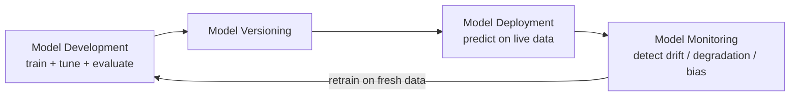

# Session 1 — Foundations of ML Systems Engineering

> **Module 1 · Lecture 1** · Slides: `Session 01 - Foundations of ML Systems Engineering.pptx` · Companion: `friend notes/1.pdf`
>
> **One-line goal:** lay the three vocabularies — *software engineering*, *data science*, *machine learning* — and end on the contrast (**SE vs ML**) that the whole course exists to bridge.

### Contents
1. [The big picture](#1-the-big-picture)
2. [The Software Development Life Cycle (SDLC)](#2-the-software-development-life-cycle-sdlc)
3. [Evolution → Cloud Native](#3-evolution--cloud-native)
4. [Data science: turning data into decisions](#4-data-science-turning-data-into-decisions)
5. [Machine learning: the core idea](#5-machine-learning-the-core-idea)
6. [The model & the ML pipeline](#6-the-model--the-ml-pipeline)
7. [Three generations of ML](#7-three-generations-of-ml)
8. [ML domains & foundation models](#8-ml-domains--foundation-models)
9. [The AI/ML engineer role](#9-the-aiml-engineer-role)
10. [SE vs ML — the fault line](#10-se-vs-ml--the-fault-line)
11. [Recap](#-recap)

---

## 1. The big picture

**Software Engineering for ML (SE4ML)** = the discipline of turning a *trained model* into a *real, running product*. Before we can, we need three vocabularies:

```
Software Engineering  →  how software is built & shipped (SDLC, roles)
Data Science          →  how data becomes decisions (pipeline, hierarchy of needs)
Machine Learning      →  how data teaches rules (pipeline, generations, foundation models)
        └──────────────►  ...and then: SE vs ML  (why this course exists)
```

---

## 2. The Software Development Life Cycle (SDLC)

**SDLC** = the structured process to **plan → build → test → deploy → maintain** software. It's the backbone every software team shares.

> 🌍 **Everyday picture — building a house.** Talk to the family (requirements) → architect draws plans (design) → builders lay bricks (implementation) → inspectors check wiring (testing) → family moves in (deployment) → for decades you fix leaks (maintenance). Software follows the same arc; only the bricks are code.

### The roles that make it happen

| Role | What they actually do |
|------|----------------------|
| Business Analyst | Turns fuzzy business needs into clear technical requirements. |
| Project Manager | Plans, coordinates, tracks — hits deadlines. |
| Product Owner | Owns the vision; decides which features matter most. |
| Team Lead | Guides the team technically, keeps tasks moving. |
| QA Team | Validates quality by systematic testing (**shift-left** = test early, when bugs are cheap). |
| Scrum Master | Runs the Agile process, clears blockers. |
| Developers | Build the functionality. |
| Software Architect | Designs the overall structure & technical strategy. |
| UX/UI Designers | Design interfaces people find easy. |
| Testers | Find defects, verify requirements are met. |

> 🧪 **Worked example — one "add Google login" feature, seven roles.** PO decides it's worth doing → BA writes "a returning user signs in with Google in <10s" → Architect picks OAuth 2.0 → Devs build the token exchange → QA tries wrong passwords / expired tokens / dropped networks (**shift-left**) → Scrum Master unblocks the late API key → PM confirms the ship date. One tiny feature, the whole cast.

> ⚠️ **Watch out.** The SDLC is a set of **activities**, not a rigid calendar. Agile revisits these stages every two weeks; Waterfall does them once in a line. Naming the stages doesn't force Waterfall.

> 🎯 **Takeaway.** The SDLC is the shared staged process + a team of specialised roles that carries software from idea to long-lived product. **ML keeps every role and adds new ones (data scientist, ML engineer) — and bends the activities (testing a model ≠ testing a login button).**

---

## 3. Evolution → Cloud Native

Software moved from slow monolithic releases toward small, fast, independently deployable pieces in the cloud. The modern end state:

$$\textbf{Cloud Native App} = \text{Agile} + \text{DevOps} + \text{Microservices} + \text{Containers} + \text{Cloud}$$

Each term removes one pain:

| Ingredient | Pain it removes |
|-----------|-----------------|
| Agile | slow up-front planning |
| DevOps | the wall between coding and releasing |
| Microservices | fragility of one giant codebase |
| Containers | "it worked on my machine" |
| Cloud | buying hardware up front |

> 🌍 **Everyday picture.** Old way: one giant food truck that cooks every dish — fryer breaks, whole truck closes. Cloud-Native: a food court of small stalls (**microservices**), each in an identical kiosk (**container**); add or repair one without shutting the others; busy night → roll in more kiosks (**cloud scaling**).

> ⚠️ The same forces push ML toward the **ADLC** (AI/ML Development Life Cycle) — the SDLC adapted for *data and models*. "Add a model" is exactly what breaks the clean SDLC. The course tools (Docker, K8s, FastAPI, SageMaker) *are* this stack.

---

## 4. Data science: turning data into decisions

**Data science** = the study of data — uncovering insights hiding inside it.

```
data  →  story  →  insight  →  decision
```

> 🌍 A doctor does data science on you: symptoms & test results = data; diagnosis = insight; prescription = decision. Nobody wants the raw blood numbers — they want the story about what they mean.

### Data science hierarchy of needs (like Maslow's pyramid)

```
        ┌─────────────┐   ← polished AI (top)
        │     AI      │
      ┌─┴─────────────┴─┐ ← learn / optimise  (Machine Learning lives HERE)
      │  ML / optimise  │
    ┌─┴─────────────────┴─┐ ← aggregate & explore
    │  aggregate/explore  │
  ┌─┴─────────────────────┴─┐ ← clean & label
  │     clean / label      │
┌─┴─────────────────────────┴─┐ ← move / store reliably
│      move / store data     │
├─────────────────────────────┤ ← collect (foundation)
│        collect data        │
└─────────────────────────────┘
```

> ⚠️ The classic failure: reach for the top ("let's add AI") while the bottom layers leak — data missing, inconsistent, unlabeled. **A fancy model on bad data is worse than no model.**

> 🎯 ML is **one layer** of this pyramid, not the whole thing. Most engineering effort is in the layers *below* the model.

---

## 5. Machine learning: the core idea

**ML** = a branch of AI that uses data + algorithms to imitate how humans learn, improving accuracy over time. The defining move: instead of a programmer writing the rules, **the data teaches the rules.**

> 🌍 Teaching a child "cat" vs "dog" with thousands of photos — never a list of rules about ears and whiskers — is ML. You didn't program the child; you *trained* them.

### Why ML is harder to engineer: three moving parts

Ordinary software has **1** thing that changes: *code*. ML has **3**: *data, model, code*.

> 🧪 **Worked example — counting the ways things break.** If each part is "unchanged" or "changed":
> - Pure software: 2¹ = **2** situations (code old or new).
> - ML: 2³ = **8** situations.
> The space of "what might have changed" is **4× larger** — which is why ML needs versioning of *data and models*, not just code.

> ⚠️ A **green test suite on the code does *not* mean the system is fine** — the data may have drifted or the model may be stale. "The code didn't change" ≠ "the behaviour didn't change."

> 🎯 This is exactly why the course later teaches **DVC** (version data) and **MLflow** (track experiments): you must control all three moving parts to reproduce a result.

---

## 6. The model & the ML pipeline

A **model** = the trained algorithm that makes predictions. It's the *core*, but it must live inside an operating **pipeline** — not be treated as a one-off file.



> 🌍 A model is not a statue you carve once — it's a **plant**: grow it (train), put it in the garden (deploy), watch it (monitor), re-pot it (retrain) as the seasons change.

> ⚠️ **"Deploy" is the middle of the story, not the end.** Most real-world ML pain — drift, degradation, outages from a bad update — happens *after* deployment, in the monitor/retrain loop. This loop is what **MLOps automates** (Prefect, MLflow, Evidently AI).

---

## 7. Three generations of ML

| Gen | Name | Where the human effort goes |
|-----|------|------------------------------|
| 1 | Basic ML | **Label datasets**, pick a classic algorithm, measure performance. |
| 2 | Deep Learning (neural nets + big data) | **Feed & retrain** bigger models; network learns features itself. |
| 3 | Transfer Learning / Transformers | **Just call an API** — pre-trained models already exist; often no training at all. |

> 🌍 Cooking across three eras: Gen 1 = grow your own veg & cook from scratch; Gen 2 = a supermarket appears, buy raw in bulk & cook; Gen 3 = a world-class kitchen delivers a finished dish you only plate — pay per meal.

> ⚠️ **Gen 3 is not always best.** Calling a giant model per request can be slower, costlier at scale, and less private than a small Gen-1 model you own. "Just use an LLM" is a trade-off, not a free lunch.

---

## 8. ML domains & foundation models

**Four capability domains:** **Language** (NLP) · **Speech** (ASR, TTS, translation) · **Computer Vision** (detection, face recognition, classification, restoration) · **Decision Services** (recommendations).

> 🌍 You use all four daily: predictive text (Language), "Hey Siri" (Speech), Face ID (Vision), "customers also bought" (Decision). Real products **combine** several — live captioning uses Speech *and* Language.

**Foundation model** = a large model trained on a broad corpus, adaptable to many tasks with minimal tuning. In practice "foundation model" and **LLM** are used interchangeably ("foundation" = broad generality; "LLM" = its size, often 100s of billions of parameters).

> 🧪 **Reading "175 billion parameters."** 175B = 1.75×10¹¹ numbers. At 2 bytes each (16-bit) ≈ **350 GB** of weights. That's why you *rent* access via API (Gen 3) — 350 GB won't fit on a laptop and training costs millions.

> ⚠️ Bigger ≠ smarter for *your* task. A fine-tuned small model can beat a giant general one on a narrow job, far cheaper.

---

## 9. The AI/ML engineer role

Gen-3 created a new job — the **AI Engineer** (Generative AI Engineer). Its skill list *is* the syllabus in miniature: solid software engineering; Python/SQL/backend; CI/CD; Git & GitHub; LLMs & transformers; RAG; prompt engineering; foundation models; fine-tuning; Model Context Protocols.

> 🎯 Notice what dominates: **software engineering, not exotic math.** "I can train a model" ≠ "I can ship an ML product." The job is mostly the engineering *around* the model — data plumbing, APIs, testing, deployment, monitoring. **That gap is what this course closes.**

---

## 10. SE vs ML — the fault line

The sharpest difference is the **specification** — the precise statement of what the system must do.

- **SE:** spec is clear & specific — "if the password is wrong, show this error." You can write the exact rule.
- **ML:** spec is *missing* — nobody can write the exact rule for "is this a cat?" You can only show examples and hope the model generalises.

| Aspect | Software Engineering | Machine Learning |
|--------|----------------------|-------------------|
| Approach | Structured, process-oriented | Data-focused |
| Methodology | Agile / Waterfall lifecycle | Data-heavy; preprocessing is crucial |
| Nature of work | **Deterministic** logic, predefined stages | **Probabilistic** models, experimental & iterative |
| Focus | System design & process | Algorithms for pattern recognition |
| Evaluation | **Functional correctness** (right/wrong) | **Model accuracy** (how often right) |

> 🌍 A **vending machine is SE**: press B4, get slot B4's chips — deterministic. A **sommelier is ML**: "this tastes like blackberry" is a judgement learned from thousands of tastings — you can't write the spec, only train the palate.

> 🧪 **In numbers.** SE login: "wrong password" → "access denied", *every time* (binary correctness). ML spam filter: one email → "spam, p = 0.87" — accepted because 0.87 > 0.5, but it *could* be wrong; quality is accuracy across many emails (say 96%). **SE asks "is it correct?"; ML asks "how often is it correct?"**

> ⚠️ Don't judge an ML component like a function. A single wrong prediction is **not a bug** — some error rate is expected. The engineering question is whether accuracy is *good enough* and *what happens when the model is wrong*.

---

## 🎯 Recap

We built three vocabularies + one contrast:
- **SE** → the SDLC, its roles, and the march to Cloud Native.
- **Data science** → data→decision, and the hierarchy of needs that puts ML in its place.
- **ML** → data teaches the rules; **3 moving parts** (data/model/code); a **living pipeline**; **3 generations**; **4 domains**; foundation models.
- **SE vs ML** → the fault line of *specification, determinism, and how we judge quality* — the gap the rest of the course bridges.

➡️ **Next:** [Session 2 — what changes when we move from a model to a whole system](Session-02-From-Models-to-Systems.md).
