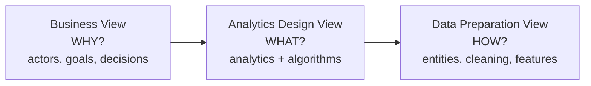

# Session 3 — Requirements Engineering for ML

> **Module 2 · Lecture 3** · Slides: `Session 03 - Requirements Engineering for ML.pptx` · Companion: `friend notes/5.pdf`
>
> **One-line goal:** answer the questions you must settle *before* building — *is ML even the right tool?* and *what exactly should it achieve?*

### Contents
1. [When to use ML](#1-when-to-use-machine-learning)
2. [Requirements engineering for ML](#2-requirements-engineering-for-ml-systems)
3. [Goals — the four levels](#3-goals--the-four-levels)
4. [How goals relate: support & conflict](#4-how-goals-relate-support--conflict)
5. [From goals to requirements](#5-from-goals-to-requirements)
6. [GR4ML notation & its three views](#6-gr4ml-notation--its-three-views)
7. [Measuring goals well](#7-measuring-goals-well)
8. [Accuracy vs precision](#8-accuracy-vs-precision)
9. [Recap](#-recap)

---

## 1. When to use machine learning

ML is **not** always the answer. **Geoff Hulten** gives three signatures of problems where ML earns its place. If none apply, plain rules are cheaper and safer.

| Case | Why rules fail | Example |
|------|----------------|---------|
| **1. Intrinsically hard** | Ambiguity, sarcasm, context defeat grammar rules & dictionaries | Understanding human language |
| **2. Big problems** | Manual rule systems become unmanageable at scale | Recommending songs to millions from tens of millions of tracks |
| **3. Time-changing** | Fixed rules go stale; adversaries adapt | Fraud detection ("flag > ₹50,000 at night" is quickly bypassed) |

> 🌍 A **spam filter is all three at once**: wording is subtle (hard), arrives in huge volume (big), mutates weekly (time-changing) — which is exactly why it's ML, not a fixed blocklist.

> 🧪 **The song-recommendation blow-up.** 10M users × 50M tracks. A "does user *u* like track *t*?" rule for every pair = 10⁷ × 5×10⁷ = **5×10¹⁴ rules (500 trillion)** — impossible. The ML alternative: *one* trained model that generalises across users and tracks. The numbers force the choice.

> ⚠️ The flip side: for a **small, stable, specifiable** problem ("add 18% tax"), ML is the *wrong* tool — it adds data needs, uncertainty, and maintenance where a one-line rule would do.

> 🎯 Use ML when you **cannot write the rules by hand** (hard / big / time-changing). Otherwise, write the rules.

---

## 2. Requirements engineering for ML systems

**Requirements engineering** = deciding what a system must do. For ML it changes shape, because ML is **probabilistic, not deterministic**.

> 🌍 Specifying a **calculator** is easy: 2+2 must equal 4, always. Specifying a **weather app** is different — you can't demand "always correct," only "≥ 85% of rain forecasts right, measured monthly." **ML requirements look like the weather app, not the calculator.**

ML requirements must be **measurable, data-aware, and model-aware** — each considering:
- where the data comes from and how good it is (**data quality & availability**),
- how the model behaves when unsure (**behaviour under uncertainty**),
- how it keeps learning as the world changes (**continuous learning & updates**).

> ⚠️ Writing an ML requirement as if it were deterministic ("the model must *never* misclassify") is impossible to meet and signals a misunderstanding.

> 🎯 Every metric you later monitor (accuracy, precision, recall, latency) is **born here**, as a measurable requirement.

---

## 3. Goals — the four levels

A **goal** = a desired outcome of the *overall system*, aligned across model, product, user, and organisational levels, expressed in **measurable** terms. Model accuracy alone is not enough.

| Level | Answers | Measured by | E-commerce example |
|-------|---------|-------------|--------------------|
| **Organisational** | *Why* are we building this? | KPIs: revenue, retention, churn | Increase sales revenue 20% |
| **Product** | *What* should the product achieve? | Task success, feature usage | Recommend relevant products |
| **User** | What do users want to *do*? | Satisfaction, completion rate | Find products quickly & easily |
| **Model** | How well does the model *predict*? | Accuracy, precision, recall, F1 | High recommendation CTR |

> 🌍 A football team's goal isn't "the striker scores" (one player's goal) — it's to **win the league**, which needs defence, fitness, tactics aligned. Optimising only the striker (the model) loses the season (the system).

> 🧪 **Turning "make the chatbot useful" into measures.** Org → "cut support cost" (target −20%). Product/User → "solve problems quickly" (task success ≥ 80%). Satisfaction → completion rate + score ≥ 4/5. Model → intent-classification accuracy ≥ 90%. *"Useful" became four measurable targets across four levels.*

---

## 4. How goals relate: support & conflict

Goals are interconnected & hierarchical — they can **support** or **conflict**, forcing trade-offs.

- **Support:** higher model accuracy → better user experience.
- **Conflict:** higher accuracy may need a bigger, slower model → hurts latency; higher quality → higher cost.

> 🧪 **The accuracy–latency trade-off.** Small model: 92% accuracy, 40 ms. Big model: 96% accuracy, 300 ms — **7.5× slower**. The model goal (accuracy) and the user goal (fast) pull apart. For **live captioning**, latency wins → keep the small model *deliberately*.

> ⚠️ Optimising one goal blindly (usually accuracy) often silently damages another (latency, cost, fairness). These trade-offs reappear as **quality attributes** in Session 4.

---

## 5. From goals to requirements

The chain that turns a fuzzy goal into a concrete model to build:

```
GOAL  →  DECISION people routinely make  →  PREDICTION that decision needs  →  ML requirement
```

> 🌍 A shop's goal = more profit. A routine **decision** = "how much stock to order." That needs a **prediction** = "how much will sell next week?" That prediction is a job for **ML**. The chain turned a vague goal into a concrete model.

This chain is formalised in the **GR4ML** notation.

---

## 6. GR4ML notation & its three views

**GR4ML** (Goal-oriented Requirements for Machine Learning) = a conceptual modelling framework that connects **business, analytics, and data** so the model you build actually serves the business goal.

> 🌍 GR4ML is like an architect's drawings before construction: one for *why* the building exists, one for *what* rooms it needs, one for *how* the plumbing runs. Don't train a model without them.



### Business View (Why?)

Identifies **actors, goals, decisions**. Elements:

| Element | Meaning |
|---------|---------|
| **StrategicGoal** | High-level business objective |
| **DecisionGoal** | A specific decision needed to fulfil it |
| **QuestionGoal** | A question that must be answered to support the decision |
| **Insight** | Data-driven answer to the question |
| **Indicator** | Metric for whether strategic goals are met |
| **Actor** | Stakeholder who drives decisions & needs insights |

> 🧪 **Credit-risk in a bank.** StrategicGoal: "make good lending decisions quickly & safely." Actor: the **case worker**. DecisionGoal: "approve/reject this application." QuestionGoal: "how likely to default?" Insight: predicted default risk. Indicator: default rate; model refreshed at `UpdateFrequency = monthly` over a `learningPeriod` of history. *Six elements turn "reduce bad loans" into a precise ML requirement.*

> ⚠️ Skipping the Business View and jumping to "train a model" is how ML projects end up technically impressive but **business-useless**. The actor and decision come first.

### Analytics Design View (What?)

Defines the **type** of analytics (descriptive / diagnostic / predictive / prescriptive), selects algorithms, considers trade-offs. Elements: **AnalyticsGoal, Algorithm, SoftGoal** (quality attribute e.g. accuracy/interpretability), DescriptionGoal, PredictionGoal, PrescriptionGoal, **Influence**.

> 💡 For the bank: AnalyticsGoal = "predict default risk" (a PredictionGoal). SoftGoals = accuracy **and interpretability** — a bank must *explain* a rejection, so a slightly less accurate but explainable algorithm may win. SoftGoals **influence** algorithm choice.

### Data Preparation View (How?)

Defines data sources, features, transformations. Elements: **Entity** (table), **DataPreparationTask**, **Operator**, **Data Cleaning** (remove noise/missing/inconsistencies), **Data Reduction** (shrink size/dimensionality), Algorithm (normalisation/encoding), Mechanism/Data Flow.

> 🧪 **Whole GR4ML model for the bank.** Business: 1 strategic goal, 1 actor, 1 decision, 1 question. Analytics: 1 prediction goal, 2 soft goals, candidate algorithms. Data: 1 entity, 2 prep tasks (clean, reduce), operators (normalise, encode). *One small, fully traceable spec from "why" down to "how" — that traceability is the whole point of GR4ML.*

---

## 7. Measuring goals well

A **measure** (metric) = a standard way of measuring something (e.g. a classifier's false-positive rate). A good measure has **three** properties:

1. **Directly relates** to a goal
2. **Quantifiable & objective**
3. **Practical to collect**

> 🌍 To measure "am I getting fitter?", **resting heart rate** is good: relates to fitness, objective number, cheap watch collects it. "General vibe" fails all three.

> ⚠️ A **vanity metric** (easy to collect but only loosely tied to the goal) is dangerous — optimising it *looks* like progress while the real goal stalls. Check the direct-relation property first.

---

## 8. Accuracy vs precision

Two confused words that mean different things:

- **Accuracy** = closeness to the **true value** (low **bias**).
- **Precision** = **consistency** of repeated results (low **variance**) — same answer each time, whether right or wrong.

```
Dartboard mental model:
  ●● ●     tight cluster, wrong corner   → PRECISE but INACCURATE
   (◎)     tight cluster on bullseye     → ACCURATE + PRECISE  ✅ (goal)
  ● ● ●    scattered around bullseye     → ACCURATE but IMPRECISE
  ● ●  ●   scattered, wrong place        → NEITHER
```

> 🧪 **A scale that's precise but not accurate.** True weight 70.0 kg. Readings: 72.1, 72.0, 72.2, 71.9, 72.0. Spread ≤ 0.3 kg → **highly precise**. Average = 72.04 kg; error = 72.04 − 70.0 = **2.04 kg** → **inaccurate** (biased high ~2 kg). *Consistently wrong.* A calibration fixes the bias without touching the (good) precision.

> 💡 **ML connection:** this is the **bias–variance** distinction. Accuracy = low bias (centred on truth); precision = low variance (low scatter). The dartboard is the picture every ML engineer carries.

> ⚠️ High precision *feels* trustworthy but a precisely wrong measurement (miscalibrated scale, biased survey) is consistently misleading. Check closeness to truth, not just consistency.

---

## 🎯 Recap

- **When to use ML:** hard / big / time-changing problems — not small, stable ones.
- **Why ML requirements differ:** probabilistic → measurable, data-aware, model-aware specs.
- **Goals** span four levels (org / product / user / model); they **support or conflict** → trade-offs.
- **Goals → requirements** by tracing decisions → predictions → ML.
- **GR4ML** formalises this in three views: **Business (why) · Analytics (what) · Data (how)**.
- **Measure well**, and keep **accuracy (closeness to truth)** distinct from **precision (consistency)**.

➡️ **Next:** [Session 4 — quality attributes and thinking like a software architect](Session-04-Quality-Attributes-and-System-Architecture.md).
