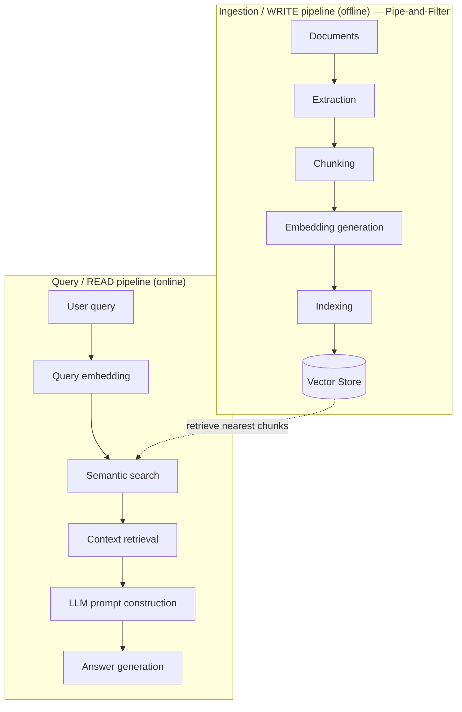

# Session 5 — Architectural Patterns for ML Systems

> **Module 3 · Lecture 5** · Slides: `Session 05 - Architectural Patterns (CQRS, RAG, Monolith, Microservices).pptx` · Companion: `friend notes/7.pdf`
>
> **One-line goal:** four workhorse patterns — **CQRS · RAG · Monolith · Microservices** — and the trade-offs that decide which to reach for.

### Contents
1. [Architecture is recombination](#1-architecture-is-recombination)
2. [CQRS — separate reads from writes](#2-cqrs--separate-reads-from-writes)
3. [RAG — retrieval-augmented generation](#3-rag--retrieval-augmented-generation)
4. [Monolith vs Microservices](#4-monolith-vs-microservices)
5. [Choosing a pattern from the quality you need](#5-choosing-a-pattern-from-the-quality-you-need)
6. [Recap](#-recap)

---

## 1. Architecture is recombination

> 💡 Most architecture is **not invention** — it's choosing and combining known patterns to meet your **quality attributes** (Session 4). This session covers four workhorses and their trade-offs.

---

## 2. CQRS — separate reads from writes

**Command–Query Separation** (Bertrand Meyer, in Eiffel): a method should either **do something** (a *command*, changing state) or **return data** (a *query*), **never both**. **CQRS** (Command Query Responsibility Segregation, popularised by Greg Young) raises this to the architecture: handle writes and reads with **separate models and stores**.

| | Command side (write) | Query side (read) |
|---|---|---|
| HTTP verbs | POST / PUT / DELETE | GET |
| In ML systems | updates data / models / features | serves predictions, metrics, dashboards |
| Optimised for | correctness | speed (denormalised, cached, indexed) |

```
        ┌──────────────┐         ┌──────────────┐
writes →│ Command model│──event→ │  Query model │→ reads
        │ (write store)│  stream │ (read store) │
        └──────────────┘         └──────────────┘
   separated by: Kafka/Kinesis (event streams),
   RabbitMQ/ActiveMQ (brokers), Airflow/Prefect (async pipelines)
```

> 💡 In plain CRUD, reads and writes share **one model** and contend for the same rows (shared/exclusive **locks**, tangled security, one schema serving two very different access patterns). Splitting them lets each side be modelled, scaled and secured **independently**.

### Eventual consistency

With separate stores, an update appears on the read side only **after it propagates**. **Eventual consistency** = not immediately identical everywhere, but all components **converge** after synchronisation.

> 🧪 **Is the staleness window acceptable?** OpenAI releases model 6.0 at 12:00 PM. The registry metadata updates *immediately*, but inference servers, edge regions, caches and user sessions receive it over the next few minutes — some users get it now, others stay on the old version briefly, and eventually **all endpoints synchronise**. For model metadata/dashboards a sub-second window is invisible → *fine*. For a **bank balance** shown right after a transfer → *not fine*, you'd need strong consistency. **CQRS trades a brief stale window for independent scaling — accept it only where the window doesn't violate a requirement.**

> 🎯 CQRS shines when read and write workloads differ greatly in volume or shape — e.g. an ML system that updates models *rarely* but serves predictions *constantly*.

---

## 3. RAG — retrieval-augmented generation

**RAG** grounds an LLM in external / proprietary / up-to-date data: **fetch relevant context first, inject it into the prompt, then generate.** It reduces **hallucination** and lets the model answer from private/fresh knowledge **without retraining**.

> 🌍 RAG is an **open-book exam**. Instead of memorising everything (retraining), the model is handed the relevant pages (retrieval) and answers from them. Update the book → the answers update, no re-study needed.

**RAG = Pipe-and-Filter + CQRS.** Two paths:



> Only the **index** changes when knowledge is updated — the model is untouched (that's the CQRS write/read split).

### Building blocks

| Block | Role | Examples |
|-------|------|----------|
| **Orchestration** | wires the app | **LangChain** |
| **Embeddings** | text → vectors | OpenAI, BERT, Sentence-Transformers, DPR, GloVe |
| **Vector store** | retrieves nearest context | Pinecone, FAISS, **ChromaDB**, Elasticsearch+kNN |
| **LLM** | generates grounded answer | GPT etc. |

> 💡 **ChromaDB internals:** stores text in **SQLite** tables + embeddings as vectors linked to those records. Each **chunk = one document**. Uses an **HNSW** (Hierarchical Navigable Small World) index for fast similarity search. A collection holds `IDs · Documents · Metadata · Embeddings`.

---

## 4. Monolith vs Microservices

- **Monolith** = all functionality in **one deployable unit** with a shared database (UI, orders, payments, ML model together). Classic example: **FTGO** (Food-To-Go, a Swiggy/Zomato-like app) — one app unit, single MySQL DB, external services via adapters (Twilio, AWS SES, Stripe).
- **Microservices** = the app as a **collection of independently developed, deployed & scaled services**, each with a **single responsibility** (Robert C. Martin: *"gather what changes for the same reasons; separate what changes for different reasons"*).

| | Monolith | Microservices |
|---|----------|---------------|
| Deployment | one unit (single WAR file) | many independent services |
| Scaling | **all-or-nothing** | **per-service** |
| Latency | in-process (low) | network hops |
| Complexity | low | distributed-systems overhead |
| Testing | end-to-end easier | harder (distributed) |
| Best for | prototypes, small teams | large, independently-scaling systems |
| Weakness | tech lock-in, scale whole app, hard to understand as it grows, single point of failure | networking, monitoring, partial failure |

> 🧪 **Splitting an ML app into services.** A monolithic predictor (UI/API + preprocessing + model load + predict in one codebase) split **by capability**: a **gateway** (`:8000`, routing/auth), a **model service** (`:8001`, inference only), a **logging service** (`:8002`, observability) — over REST / gRPC / GraphQL or Kafka. Now the model service can scale on **GPU nodes independently**, and a model update redeploys **only that service**.

> ⚠️ Microservices are **not automatically better** — they add real distributed-systems complexity (networking, monitoring, distributed data, partial failure). For a prototype or small team the **monolith wins** (no network latency, low overhead). Choose microservices only when independent scaling/deployment genuinely pays for the complexity.

---

## 5. Choosing a pattern from the quality you need

> 🧪 A team is told: *"the prediction API must scale independently of training jobs; reads vastly outnumber writes; answers must cite current internal documents."* Decompose:
> 1. Scale serving independently → **microservices** (separate model service on GPU nodes).
> 2. Reads ≫ writes → **CQRS** (read-optimised store, accept eventual consistency).
> 3. Cite current documents → **RAG** (retrieve-then-generate over a fresh index).
>
> No single pattern wins — the **qualities dictate the combination**. The choice is driven by requirements, not fashion.

> 🎯 There is **no "best" architecture, only the best fit for your quality attributes.** A real system may serve via **microservices**, split reads/writes with **CQRS**, ground an LLM with **RAG**, and *start life as a monolith* — each chosen to make a required quality easy.

---

## 🎯 Recap

- **Architecture = recombination** of known patterns to hit your QAs.
- **CQRS** — separate write & read models/stores; great when read/write loads differ; costs **eventual consistency**.
- **RAG** — retrieve-then-generate; grounds an LLM cheaply without retraining; it's **Pipe-and-Filter + CQRS**.
- **Monolith vs Microservices** — one unit (simple, low-latency) vs independent services (independent scaling, distributed complexity).
- **Compose patterns**; let **requirements**, not fashion, drive the choice.

➡️ **Next:** [Session 6 — event-driven architecture and ML design patterns (registry, batch vs real-time serving)](Session-06-Event-Driven-Architecture-and-ML-Design-Patterns.md).
