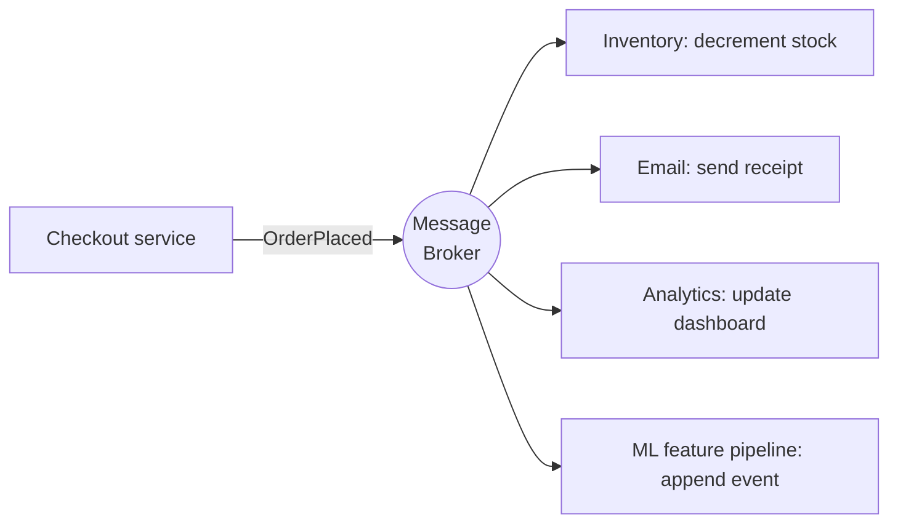

# Session 6 — Event-Driven Architecture & ML Design Patterns

> **Module 3 · Lecture 6** · Slides: `Session 06 - Event-Driven Architecture & ML Design Patterns.pptx` · Companion: `friend notes/8.pdf`
>
> **One-line goal:** three patterns that keep ML systems maintainable — **decouple with events, version with a registry, serve at the right freshness.**

### Contents
1. [Event-Driven Architecture](#1-event-driven-architecture)
2. [The Model Registry pattern](#2-the-model-registry-pattern)
3. [Git vs the ML registry](#3-git-vs-the-ml-registry)
4. [Batch vs Real-time serving](#4-batch-vs-real-time-serving)
5. [Recap](#-recap)

---

## 1. Event-Driven Architecture

**Context:** many asynchronous events arrive from users, systems, and processes.
**Problem:** you need **asynchronous communication, decoupling, scalability, reliability**.
**Solution:** **publish–subscribe** over a **message broker**.

| Component | Role |
|-----------|------|
| **Publisher (producer)** | Emits events to a bus |
| **Subscriber (consumer)** | Registers interest, is notified |
| **Message broker** | Reliable delivery, queuing, persistence — Kafka, RabbitMQ, Amazon SQS, Azure Service Bus |

> 💡 Instead of services calling each other directly and *waiting*, a service **announces that something happened and moves on**; anyone who cares listens. The publisher never needs to know who the subscribers are — **that ignorance is exactly what gives loose coupling.**



> 🧪 **An order event fans out.** Checkout publishes `OrderPlaced`. Independently & asynchronously: inventory decrements stock, email sends a receipt, analytics updates a dashboard, an ML feature pipeline appends to the user's event stream. Checkout knows **none of them** — add a fifth consumer tomorrow and checkout code doesn't change. *Decoupling + independent scaling in one move.*

> 🎯 EDA is the backbone that links CQRS's command & query sides and feeds streaming features/predictions.

---

## 2. The Model Registry pattern

A **design pattern** = an established best practice for a recurring problem (here, in data prep / training / serving).

| Context | Registry means… |
|---------|-----------------|
| Software Engineering | A creational pattern: a central hub to **register, locate, retrieve** class instances/services |
| Machine Learning | A **centralized repository** that **tracks, versions, manages, governs** ML models across their lifecycle |

**Red Hat:** in data science the model registry is the **"source of truth"** bridging experimentation and production — it tracks the entire **model lineage** from development to deployment.

> 🎯 The registry records full **model lineage** — *which experiment and run* produced a model, on *what data and parameters* — giving reproducibility, plus **stage promotion** (staging → production) and **rollback**. Tools: **MLflow, DVC, Weights & Biases**.

**MLflow Model Registry features:** version control (compare, rollback, parallel deploys) · model lineage & traceability (links each version to its run/data/params) · production-ready workflows (promotion via aliases/tags) · governance & compliance (metadata, access control, auditability).

---

## 3. Git vs the ML registry

**Evolution of version control:**

| Generation | Networking | Operations | Tools |
|------------|-----------|------------|-------|
| 1st (SD) | None | One file at a time | RCS, SCCS |
| 2nd (SD) | Centralized | Multi-file | CVS, Subversion |
| 3rd (SD) | **Distributed** | Changesets | **Git** |
| 3rd (ML) | Distributed + **artifact tracking** | Models, data, experiments | **MLflow, DVC, W&B** |

*(SD = Software Development. Git was created by Linus Torvalds in 2005.)*

| | **Git** | **Model registry** |
|---|---|---|
| Versions | source code (text) | models, data, metrics (binary) |
| Diffing | line-level text diffs | version + lineage metadata |
| Built for | small text changes | large artifacts & experiments |
| Stores | source files, docs, config | trained models, weights, datasets/refs, hyperparameters, metrics, experiment logs, lineage |

> ⚠️ **Don't force model weights into Git.** Git is built for small text diffs, *not* large binary weights, datasets, and metrics — that mismatch (bloated repos, useless diffs) is exactly why the model registry exists. **They're complementary:** Git versions code, the registry versions artifacts.

> 🧪 **A registry promotion & rollback.** New fraud model `exp-42` is logged with its data hash, hyperparameters, and validation metrics → promoted **staging → production**; serving pulls "production". A week later its false-positive rate spikes in monitoring. Because the registry kept the **previous version + full lineage**, rollback is a **one-line stage change** back to the prior model, and the post-mortem can **reproduce `exp-42` exactly**. None of this is possible if weights were dropped into a Git commit or copied to a server by hand.

---

## 4. Batch vs Real-time serving

A **deployment pattern** with one core trade-off: **data freshness vs operational complexity.**

| | **Batch (offline)** | **Real-time (online)** |
|---|---|---|
| What | Scores **many** records on a schedule, all at once | Answers **single** requests instantly via an always-on API |
| Latency | high (acceptable) | milliseconds |
| Complexity | simpler | higher (always-on service, autoscale) |
| Examples | customer segmentation, newsletter recommendations, end-of-day risk reporting | **fraud blocking, dynamic pricing, spam filtering** |

```
BATCH:   [night job] → analyse the day's activity → write list → [store]  → team uses next morning
ONLINE:  [request] → model API (always running) → "approve/deny" in ms → [response]
```

> 🧪 **Which serving mode?** Newsletter recs emailed each morning → yesterday's data is fine, throughput matters → **batch**. Card-fraud blocking at point of sale → decision in tens of ms or the transaction clears → **real-time**. *The question to ask is always: how stale can the prediction be before it loses value?*

---

## 🎯 Recap

- **Event-Driven Architecture** — publish/subscribe over a broker → loose coupling + independent scaling; the backbone linking CQRS and streaming features.
- **Model Registry** — the "source of truth" that versions & governs models with full **lineage**; enables promotion & rollback. (Git ≠ registry — don't put weights in Git.)
- **Batch vs Real-time serving** — pick freshness by use-case: **no more** (adds cost/complexity), **no less** (loses value).

➡️ **Next:** [Session 7 — agentic AI and coordination patterns (SAGA, Blackboard)](Session-07-Agentic-AI-and-Coordination-Patterns.md).
