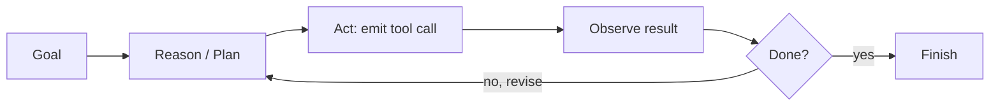
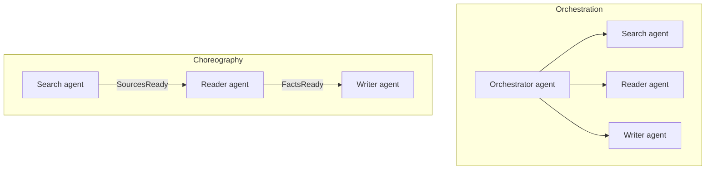
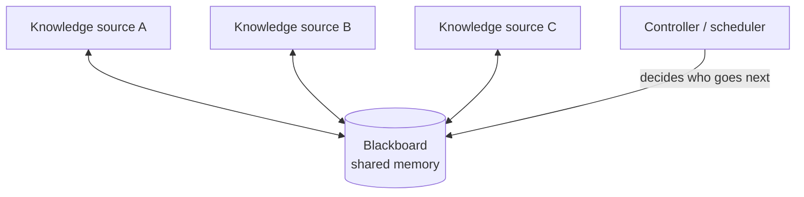

# Session 7 — Agentic AI & Coordination Patterns

> **Module 8 · Lecture 7** · Slides: `Session 07 - Agentic AI & Coordination Patterns.pptx` · Companion: `friend notes/9.pdf`
>
> **One-line goal:** from **chatbots to doers** — what makes AI "agentic," and how to coordinate many agents reliably with **SAGA** and **Blackboard**.

### Contents
1. [From chatbots to doers](#1-from-chatbots-to-doers)
2. [The LLM as a reasoning engine](#2-the-llm-as-a-reasoning-engine)
3. [Memory & tool use — the agent loop](#3-memory--tool-use--the-agent-loop)
4. [The SAGA pattern](#4-the-saga-pattern)
5. [Orchestration vs Choreography](#5-orchestration-vs-choreography)
6. [The Blackboard pattern](#6-the-blackboard-pattern)
7. [Recap](#-recap)

---

## 1. From chatbots to doers

**A chatbot answers; an agent acts.** Agentic AI takes a **goal**, plans, calls tools, observes the result, and **revises until the task is done** — with limited supervision.

**Definitions converge on autonomy:**
- *Nvidia:* "uses sophisticated reasoning and iterative planning to autonomously solve complex, multi-step problems."
- *OpenAI:* "AI systems that can pursue complex goals with limited direct supervision."

$$\textbf{Agentic AI} = \text{Generative AI} + \text{Reasoning} + \text{Tools} + \text{Feedback Loops}$$

| | Generative AI | Agentic AI |
|---|---|---|
| Stance | "Tell me what to do, I'll generate an answer" | "Give me a **goal**, I'll figure out the steps, act, and improve until it's done" |
| Tools | — | Calculators, APIs, databases |
| Memory | — | Past context, RAG, documents |

---

## 2. The LLM as a reasoning engine

Five capabilities make a modern LLM the **engine** of an agent:

| Capability | What it does |
|-----------|--------------|
| **Chain-of-thought** | Reason step by step *before* acting, not answer in one shot |
| **Instruction following** | Turn a natural-language goal into a sequence of actions |
| **Generalization** | Handle novel tasks without retraining |
| **Tool use via JSON/API** | Emit structured calls to external tools |
| **Self-correction** | Evaluate its own output and revise |

**Tool-call format (structured JSON):**

```json
// the model emits:
{ "tool_name": "get_weather", "arguments": { "city": "Bangalore" } }
// the tool returns:
{ "tool_result": "Temperature is 28°C" }
```

---

## 3. Memory & tool use — the agent loop

Two pillars support the reasoning engine: **memory/state** (past context, RAG, documents) and **tool use** (the model emits a structured call and consumes the result).



> 🧪 **The agent loop — "book me the cheapest flight next Friday."** 1) **Reason/plan** → search flights, compare, then book. 2) **Emit tool call** → `search_flights(date="Fri", sort="price")`. 3) **Execute & observe** → cheapest is $210. 4) **Reason again** → meets constraints, call `book(flight_id)`. 5) **Repeat until done**; memory carries the chosen flight across steps. *Reason → act → observe → revise underlies every agent.*

> ⚠️ Agents fail in **new ways** — they can loop, call the wrong tool, or commit a step that must be undone. That's exactly *why* the coordination patterns below matter.

---

## 4. The SAGA pattern

**The problem — distributed transaction.** When several agents/services each commit to their **own** data, a multi-step task is a *distributed transaction*. Example: an e-commerce order across 4 microservices — all must complete, and if any fails, the preceding ones must be undone to keep data integrity.

A **SAGA** runs it as a **sequence of local transactions**. Because each step **already committed** to its local DB, a later failure is undone **not by rollback but by compensating transactions** (an explicit "undo" action).

```
T1 ──✔── T2 ──✔── T3 ──✘ fails
              ↑         │
              C1  ◄── C2 ◄── run compensating transactions in reverse
   (no global rollback across independent stores)
```

> 🌍 **Booking a holiday:** book flight → hotel → car. If the car booking fails you don't get an automatic refund — you must **cancel the flight and hotel**. Those cancellations are the **compensating transactions** that unwind the committed steps.

---

## 5. Orchestration vs Choreography

Two ways to run a SAGA:

| | **Orchestration** | **Choreography** |
|---|---|---|
| Control | A **central coordinator** directs each step | **No coordinator**; each step emits an event that triggers the next |
| For agents | An **orchestrator agent** decomposes & delegates to specialised workers | **Prompt chaining** — each agent's output triggers the next |
| Pros | Easy to monitor, single point of control | Maximally decoupled |
| Cons | Coordinator is a bottleneck / single point of failure | Hard to trace end-to-end |



> 🧪 **"Research a topic and produce a cited summary."**
> - **Orchestration:** an orchestrator agent splits & delegates — search agent gathers sources, reader extracts facts, writer drafts; the orchestrator monitors progress and retries a failed worker. *Easy to observe, one point of control.*
> - **Choreography:** the search agent finishes → emits `SourcesReady` → triggers the reader → whose `FactsReady` triggers the writer. *No central control — maximally decoupled, but tracing a failure is harder.* If the writer fails after sources cost an API fee, a **compensating step** releases/refunds them — the SAGA idea applied to agents.

> 🎯 Orchestration suits agent systems needing **oversight**; choreography (prompt chaining) suits **loosely-coupled pipelines** where each step's output feeds the next.

---

## 6. The Blackboard pattern

For problems with **no well-defined algorithm**, the **Blackboard pattern** lets specialist agents collaborate through **shared memory** — like experts around a board, each adding the partial solution they can, until a collective answer **emerges**.

| Component | Role |
|-----------|------|
| **Blackboard** | Shared state: current problem, partial solutions, hypotheses, environmental data |
| **Knowledge sources** (specialist agents) | Independent agents with specific skills/tools/models; watch the board and contribute when they can help |
| **Controller / scheduler** | Monitors the board, prioritises, and picks who acts next based on emergent updates |



> 💡 **The intuition:** no single expert can solve the whole problem, and there's no fixed recipe. Each writes what they can onto the shared board; the controller decides who goes next given what is now known. The solution **emerges from contributions** rather than following a pre-planned sequence.

> ⚠️ SAGA vs Blackboard both exist *because agents fail in new ways*: **compensating transactions (SAGA)** undo committed steps, and a **controller arbitrating shared state (Blackboard)** keeps many agents from trampling each other.

---

## 🎯 Recap

**Goals in, coordinated actions out.**
- An **agent** = an LLM reasoning engine + memory + tools in a **reason → act → observe** loop.
- Coordinating several reliably needs **SAGA** (with **compensating transactions**) for multi-step distributed transactions, run via **orchestration** (central control) or **choreography** (prompt chaining / events).
- **Blackboard** (shared state + controller) handles **open-ended** collaboration with no fixed algorithm.

➡️ **Next:** [Session 9 — implementation & code sharing: what makes good ML code, and how to analyse its performance](Session-09-Implementation-and-Code-Sharing.md).
